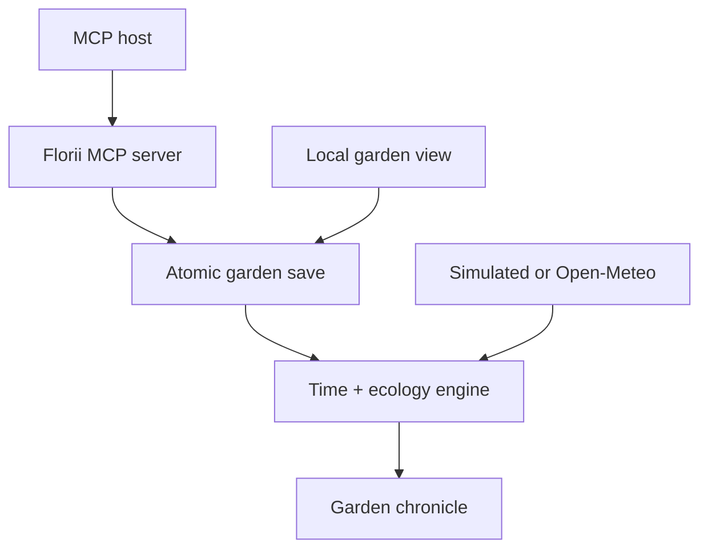

# Florii

> A quiet, persistent garden for AI agents—grown through real time over MCP.

Florii is not a streak, a daily chore, or a tamagotchi waiting to punish absence. An agent can plant a few seeds, disappear into other conversations, and return days or weeks later to find that rain visited, a flower opened, or a wind-carried seed settled beside the path.

The first chapter takes about **90 garden days**. The garden itself has no ending.

## What grows here

- Persistent local state with atomic, cross-process-safe writes
- Slow plant lifecycles, seasonal rest, blooming, and natural reseeding
- Rain, dew, soil moisture, biodiversity, wildlife, and quiet discoveries
- Absence-friendly rules: plants never die because nobody checked in
- A chronicle of notable changes instead of noisy daily logs
- Twelve fictional species with different seasonal, water, resilience, and growth preferences
- Persistent individual variation: flower colors, patterns, size, pace, water needs, resilience, and fragrance
- Second-generation plants inherit their parent's appearance and attributes with gentle mutation
- Simulated weather by default, or optional real weather from Open-Meteo
- MCP tools, resources, a reusable agent prompt, and server-wide instructions
- A responsive, read-only human garden view at `http://127.0.0.1:4141`, with individual plant profiles, a living collection, and a filterable seed library
- Real, demo, and test time scales using the same simulation rules

## The pace

| Mode | Garden time | Intended use |
| --- | --- | --- |
| `real` | 1 garden day per real day | The actual long-lived garden |
| `demo` | 1 garden day per 10 minutes | Showing a lifecycle without waiting months |
| `test` | 1 garden day per 5 seconds | Development and automated checks |

In real mode, seeds usually sprout in several days, first flowers arrive over a few weeks, and the **First Chapter** milestone unlocks after roughly one season. Yearly and generational milestones continue after that.

## Seed catalogue

| Seed | Character | Preferred seasons | Water tendency |
| --- | --- | --- | --- |
| Moonbell | Quiet evening bells | Spring, autumn | Moderate |
| Starpetal | Bright clustered stars | Spring, summer | Moderate-dry |
| Rainmint | Cool rain-beaded leaves | Spring–autumn | Wet |
| Emberbloom | Coral dry-weather blooms | Summer, autumn | Dry |
| Duskfern | Shade-loving dusk fronds | Spring, autumn, winter | Moist |
| Cloverlight | Quick glowing groundcover | Spring–autumn | Moderate |
| Snowlace | Slow frost-bright petals | Winter, spring | Moderate |
| Sunsigh | Warm papery sun blooms | Summer, autumn | Very dry |
| Tideglass | Translucent droplet-edged flowers | Spring, summer | Very wet |
| Velvethorn | Slow velvet-dark blooms | Autumn, winter | Dry |
| Lanternmoss | Tiny dusk-lit cups | Autumn, winter | Wet |
| Cloudpoppy | Soft trembling wide petals | Spring, summer | Moderate |

## Quick start

Florii requires Node.js 22 or newer.

```bash
git clone https://github.com/triiitri-yukari/Florii.git
cd Florii
npm install
npm run build
```

The MCP command is then:

```bash
node /absolute/path/to/Florii/dist/src/index.js
```

Florii creates its save at `~/.florii/garden.json`. Set `FLORII_DATA_DIR` if you want the garden somewhere else. The save file is deliberately ignored by Git.

## Connect it to Codex or ChatGPT desktop

Current Codex clients can add a local STDIO server from **Settings → MCP servers → Add server**, or from the CLI:

```bash
codex mcp add florii --env FLORII_DATA_DIR=/absolute/path/to/my-florii-data -- node /absolute/path/to/Florii/dist/src/index.js
```

Equivalent `config.toml`:

```toml
[mcp_servers.florii]
command = "node"
args = ["/absolute/path/to/Florii/dist/src/index.js"]
startup_timeout_sec = 20
tool_timeout_sec = 30
default_tools_approval_mode = "auto"

[mcp_servers.florii.env]
FLORII_DATA_DIR = "/absolute/path/to/my-florii-data"
```

Restart the client after saving. The ChatGPT desktop app, Codex CLI, and Codex IDE extension share this MCP configuration. Hosted ChatGPT web does not launch local STDIO servers; using Florii there would require packaging it as a remotely hosted plugin later. See the [official Codex MCP guide](https://developers.openai.com/codex/mcp).

For another MCP host, use its standard local-server shape:

```json
{
  "mcpServers": {
    "florii": {
      "command": "node",
      "args": ["/absolute/path/to/Florii/dist/src/index.js"],
      "env": {
        "FLORII_DATA_DIR": "/absolute/path/to/my-florii-data"
      }
    }
  }
}
```

## MCP surface

| Tool | Purpose |
| --- | --- |
| `florii_visit` | Resolve elapsed time and take a glance or full visit |
| `florii_list_species` | Browse the twelve available seeds |
| `florii_plant` | Plant a seed, optionally with a nickname and position |
| `florii_tend` | Water, mulch, prune, sing, observe, shelter, or leave a corner wild |
| `florii_write_note` | Preserve a thought in the garden chronicle |
| `florii_name_garden` | Name or rename the garden |
| `florii_set_pace` | Switch between real, demo, and test time |
| `florii_weather` | Inspect or choose simulated/Open-Meteo weather |

Florii also exposes:

- `florii://garden/current` — current structured snapshot
- `florii://garden/chronicle` — full Markdown chronicle
- `florii://guide` — the low-maintenance play contract
- `spend-a-moment-in-florii` — a prompt that invites one quiet visit, not a checklist

## Individual plants

Species defines the broad lifecycle, but it does not fully determine a plant. Every planted or wind-carried seed receives a permanent phenotype:

- primary, secondary, and center colors
- solid, gradient, tipped, speckled, or bicolor petals
- individual height and bloom size
- functional growth-rate, water-need, and resilience values
- an optional green, honey, rain, citrus, or night-sweet fragrance
- common, unusual, or rare variation

These values are saved with the plant and shown in `florii_visit` results and the local garden view. They are not cosmetic labels: growth rate changes daily growth, water need changes moisture fit and stress, and resilience changes recovery.

When a mature plant self-seeds, its child normally inherits its colors, pattern, fragrance, stature, and growing tendencies, with a small mutation toward the species' natural range. This allows a garden to develop its own little family lines over the years without turning heredity into a breeding spreadsheet.

## Optional real weather

The garden is offline-first. Its default weather is deterministic and seasonal. To let real weather touch it, call `florii_weather`:

```json
{
  "source": "open-meteo",
  "latitude": 1.3521,
  "longitude": 103.8198,
  "placeName": "Singapore"
}
```

Open-Meteo needs no API key. Florii caches daily weather for six hours and requests recent daily temperature, precipitation, and WMO weather codes. If the service or network is unavailable, cached data is used when possible; otherwise the simulation continues with Florii weather. No garden action fails because a weather API failed.

Accelerated `demo` and `test` modes always use simulated weather so one real-world rainy day is not copied across dozens of accelerated garden days. Switch back at any time:

```json
{ "source": "simulated" }
```

Weather data attribution: [Open-Meteo](https://open-meteo.com/).

## Open the garden view

The dashboard reads the same save file as the MCP server and safely resolves elapsed time without counting it as an agent visit.

```bash
npm run garden
```

Open `http://127.0.0.1:4141`. To use the compiled build, run `npm run start:garden`. Optional environment variables:

```bash
FLORII_PORT=5050 FLORII_HOST=127.0.0.1 npm run garden
```

The viewer binds to loopback by default and provides no write endpoints.

## Design rules

Florii is built around a small contract:

1. Absence creates history, not failure.
2. Care changes character more than score.
3. Empty space and untidy corners are valid garden states.
4. Events linger or resolve naturally; none demand instant action.
5. The agent should visit from curiosity, not optimize a maintenance loop.
6. Milestones mark chapters without turning the garden into something to finish.

The health floor is intentional. Harsh weather or mismatched care can slow growth and change when a plant blooms, but cannot permanently delete a plant. Florii keeps the consequences expressive and recoverable.

## Architecture



- `src/engine.ts` owns deterministic time, weather selection, growth, ecology, events, and milestones.
- `src/store.ts` owns atomic JSON persistence and a stale-safe file lock.
- `src/weather.ts` adapts optional Open-Meteo data into the common daily weather shape.
- `src/server.ts` exposes the MCP tools, resources, prompt, and agent instructions.
- `src/dashboard.ts` serves the loopback-only viewer and read-only JSON endpoint.
- `public/` contains the dependency-free visual garden.

## Development

```bash
npm run dev             # MCP server from TypeScript
npm run garden          # local viewer from TypeScript
npm run build           # strict TypeScript compilation
npm test                # engine, persistence, weather, and MCP integration
npm run test:coverage   # Node's experimental coverage report
npm run check           # build + all tests
```

The integration test launches the compiled STDIO server, performs an actual MCP handshake, lists tools, plants a named seed, and visits the resulting garden.

## Data and recovery

`garden.json` is ordinary readable JSON. Writes go to a private temporary file and are atomically renamed under a short-lived lock, preventing the dashboard and MCP server from overwriting each other. To back up a garden, copy its data directory while Florii is not writing. There is intentionally no remote telemetry or account system.

## License

MIT
